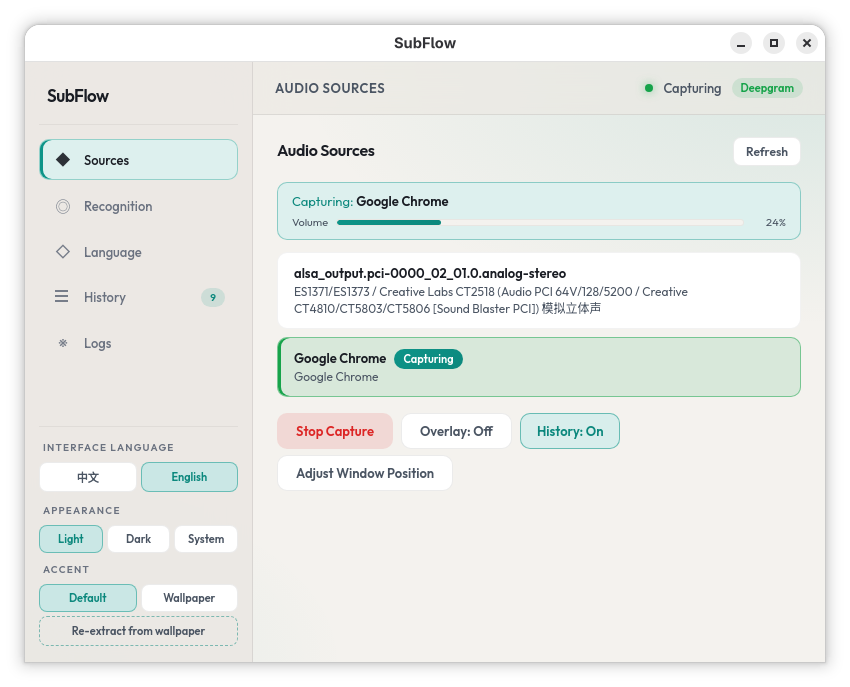
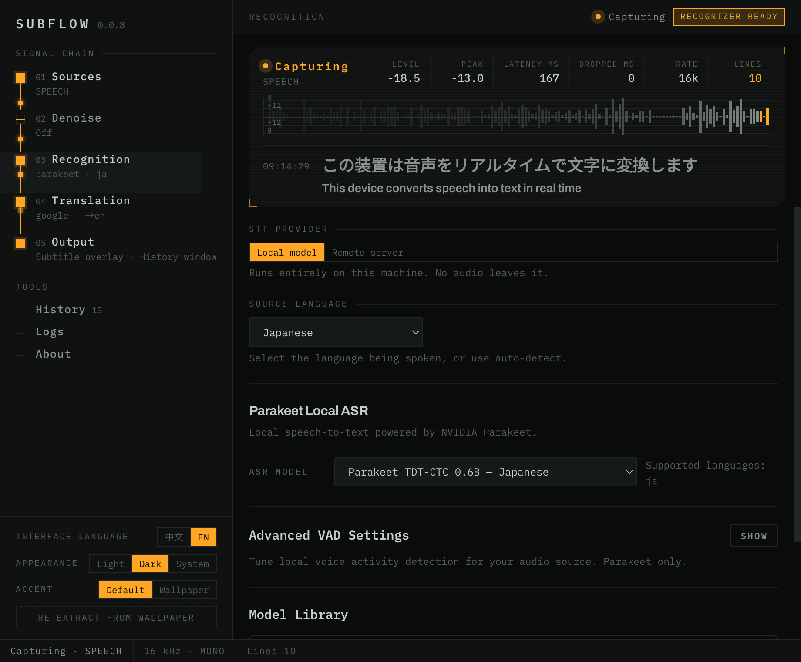
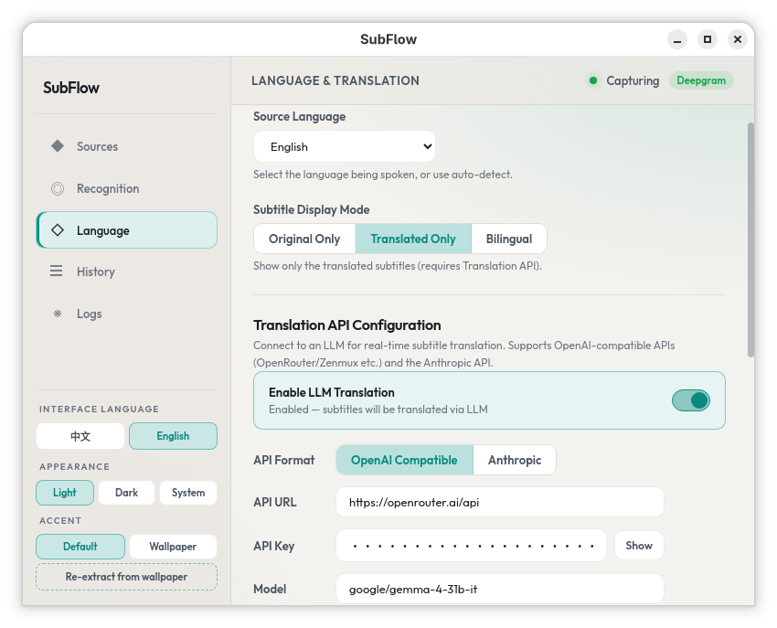

# 🎙️ SubFlow — 实时语音字幕

<p align="center">
    
</p>

<p align="center">
  <a href="https://github.com/mochizuki0323/subflow/actions/workflows/release.yml?branch=master"></a>
  <a href="https://github.com/mochizuki0323/subflow/releases"></a>
  <a href="LICENSE"></a>
</p>

SubFlow 是一款基于 Deepgram 与 LLM 开发的实时语音字幕工具，支持捕获系统音频并实现流式转录显示。通过接入 OpenAI 兼容或 Anthropic 等接口，能够通过 LLM 结合预设的场景提示词与历史上下文对文本进行实时后处理，用于优化断句、纠正翻译并提升多段输出的连贯性。

[English](README.md) · [发行版](https://github.com/mochizuki0323/subflow/releases) · [许可证](LICENSE)

## 预览

<p>
  
  
  
</p>

## 功能特性

- **实时转录** — Deepgram Nova-3 流式语音转文字
- **语音降噪** — 基于 sherpa-onnx 的噪音抑制（DPDFNet / GTCRN 模型）；在转录前去除背景噪音，提升识别准确率
- **应用级与系统音频捕获** — PipeWire (Linux) 和 WASAPI (Windows)；支持捕获单个应用或整个系统音频输出
- **可选 LLM 层** — OpenAI 兼容与 Anthropic 等接口：翻译与后处理（场景提示词、历史上下文及相关选项）
- **叠层 + 历史窗口** — 可拖动、可调整大小的半透明字幕叠层和可滚动历史面板
- **多种字幕模式** — 原文、翻译或双语显示
- **深色 / 浅色 / 跟随系统** — 跟随桌面外观，支持壁纸取色

## 安装

### Linux

从 [Releases](../../releases) 下载最新版本：

- AppImage — `subflow-*-linux-x86_64.AppImage`
- Debian/Ubuntu — `subflow-*-linux-amd64.deb`
- Fedora/RHEL — `subflow-*-linux-x86_64.rpm`

```bash
# AppImage
chmod +x subflow-*-linux-x86_64.AppImage
./subflow-*-linux-x86_64.AppImage

# Debian/Ubuntu
sudo dpkg -i subflow-*-linux-amd64.deb

# Fedora
sudo dnf install subflow-*-linux-x86_64.rpm
```

### Windows

从 [Releases](../../releases) 下载。

## 从源码构建

### 前置依赖

**Linux (Fedora):**

```bash
sudo dnf install gcc-c++ clang cmake ninja-build \
  openssl-devel pipewire-devel \
  nodejs npm
```

**Linux (Debian/Ubuntu):**

```bash
sudo apt install build-essential clang cmake ninja-build \
  libssl-dev libpipewire-0.3-dev \
  nodejs npm
```

### 构建

```bash
git clone --recursive https://github.com/mochizuki0323/subflow.git
cd subflow
npm install

# 下载预编译的 sherpa-onnx 库（降噪功能所需）
bash scripts/setup-sherpa-onnx.sh

# 构建全部（后端 + 前端）
bash scripts/build.sh

# 运行
npm start
```

### 打包

```bash
# Linux (AppImage + deb + rpm)
bash scripts/dist-linux.sh

# 从 Linux 交叉编译 Windows 便携版
# 需要: mingw64-gcc-c++ mingw64-openssl mingw64-winpthreads-static
bash scripts/dist-windows.sh
```

## 配置文件

- **Linux**（AppImage / deb / rpm）：`~/.config/subflow_settings/config/`
- **Windows**：exe 同目录下的 `config/` 文件夹

## 许可证

[MIT](LICENSE)
